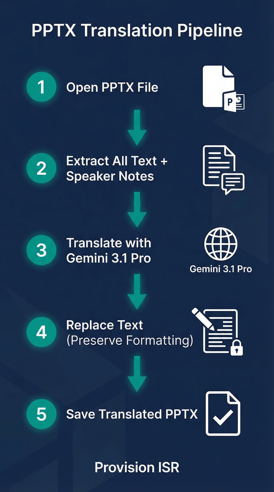

# Provision PPTX Translate

> Translate PowerPoint presentations to any language while preserving design, formatting, and animations.



## What it does

- Translates all slide text, titles, tables, charts, SmartArt, and speaker notes to any target language
- Preserves all formatting: fonts, colors, sizes, bold/italic/underline, alignment, animations, and transitions
- Keeps product names and technical terms untranslated (configurable)
- Supports RTL languages (Hebrew, Arabic) with automatic alignment adjustment
- Batch-translates multiple files to multiple languages in one run

## Quick Install

```bash
# Clone into Claude Code skills directory
cd ~/.claude/skills
git clone https://github.com/guyaga/provision-pptx-translate.git

# Restart Claude Code - the skill is auto-detected!
```

## Prerequisites

- **Python 3.10+**
- **Google Gemini API key** (free tier available)
- No FFmpeg, no ElevenLabs, no PowerPoint installation needed

## Setup

1. Get your API key:
   - **Google Gemini** (free): https://aistudio.google.com → Get API Key

2. Install Python packages:
   ```bash
   pip install python-pptx google-genai
   ```

3. Create a project folder and add your config:
   ```bash
   mkdir my-project && cd my-project
   mkdir -p input translated
   ```

4. Create `config.json`:
   ```json
   {
     "gemini_api_key": "YOUR_GEMINI_API_KEY",
     "gemini_model": "gemini-3.1-pro",
     "target_language": "Spanish",
     "target_languages": ["Spanish", "Italian", "French"],
     "preserve_terms": ["Provision ISR", "DDA", "NVR", "VMS", "PTZ", "LPR"],
     "translate_speaker_notes": true,
     "output_dir": "translated"
   }
   ```

5. Place your `.pptx` files in the `input/` folder.

## Usage

Open Claude Code in your project folder and say:
```
Translate my presentation to Spanish
```

Or use the skill command:
```
/provision-pptx-translate
```

## How it works

1. **Open** the .pptx file (internally a zip of XML files)
2. **Extract** all text from slide text boxes, titles, tables, charts, SmartArt, speaker notes, and group shapes
3. **Translate** text in batches via Gemini 3.1 Pro, preserving product names and technical terms
4. **Replace** text run-by-run in the PPTX XML, preserving all character-level formatting
5. **Save** the translated PPTX as a new file with a language suffix

## Files included

| File | Description |
|------|-------------|
| `skill.md` | Skill definition for Claude Code |
| `guide_he.pdf` | Hebrew installation guide (PDF) |
| `infographic.png` | Visual pipeline diagram |
| `templates/` | Ready-to-use Python scripts |

## Templates

| File | Description |
|------|-------------|
| `templates/translate_pptx.py` | Main translation script -- translates a single PPTX to one language |
| `templates/batch_translate.py` | Batch translation -- multiple files and/or multiple languages |
| `templates/validate_translation.py` | Validates output by comparing original and translated PPTX |
| `templates/config.json` | Configuration template with all available options |

## Built for

[Provision ISR](https://provisionisr.com) - Security camera and NVR solutions

## Powered by

- **Gemini 3.1 Pro** - Translation engine

---

*Built with Claude Code*
